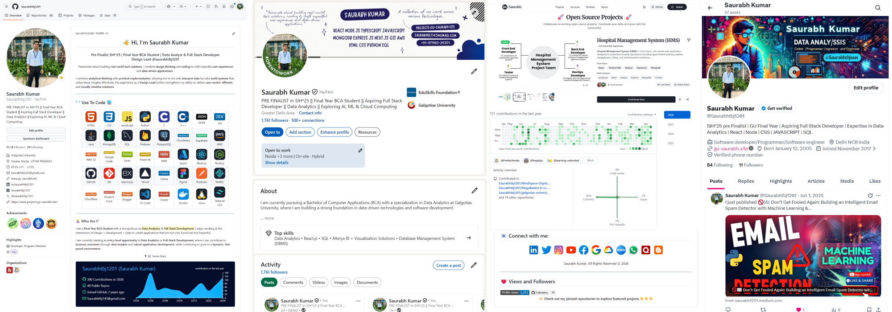
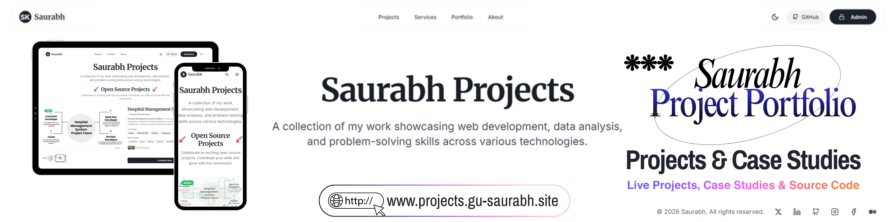
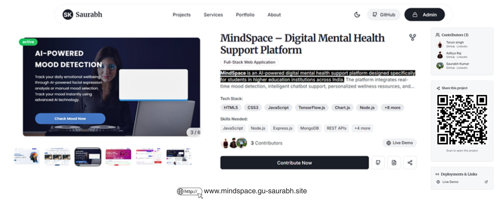
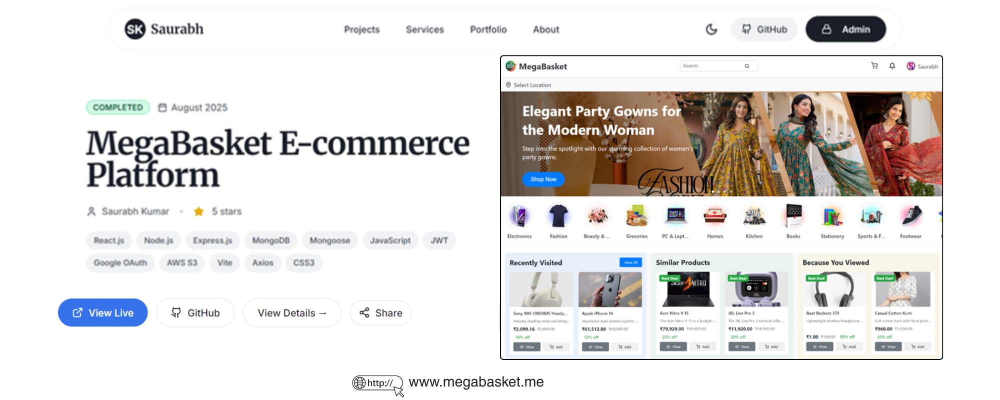
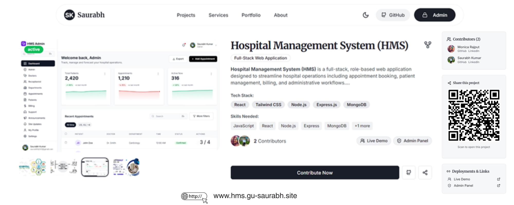

                     
<h1 align="center">👋 Hi, I'm <b>Saurabh Kumar</b></h1>

<h3 align="center">
Pre Finalist <b>SIH*25</b> | Final Year <b>BCA Student</b> |  
<b>Data Analyst</b> & <b>Full-Stack Developer</b>  
Design Lead <b>@saurabhtbj1201</b>
</h3>

  <i>"Passionate about building <b>real-world tech solutions</b>, I combine <b>design thinking</b> and <b>coding</b> to craft impactful <b>user experiences</b> and <b>data-driven applications</b>."</i>

### 👨‍💻 Who Am I?

I am a <b>Final Year BCA Student</b> with a strong focus on <mark><b>Data Analytics</b></mark> & <mark><b>Full Stack Development.</b></mark> I enjoy working at the intersection of <u><i>Design</u> + <u>Development</u> + <u>Data</i></u> to create applications that are not only functional but impactful.

I combine <b>analytical thinking</b> with <b>practical implementation</b>, allowing me to not only <b>interpret data</b> but also <b>build systems</b> that utilize those insights effectively. My experience as a <b>Design Lead</b> further strengthens my ability to deliver <b>user-centric</b>, <b>efficient</b>, and <b>visually intuitive solutions</b>.

I am currently seeking an <b>entry-level opportunity</b> in <b>Data Analytics</b> or <b>Full-Stack Development</b>, where I can contribute to <b>business outcomes</b> through <b>data insights</b> and <b>robust application development</b>, while continuing to grow in a <b>dynamic, fast-paced environment</b>.

---

## <b> Use To Code</b> 💻

<table align="center">
  <tr>
    <td align="center" width="90"> HTML</td>
    <td align="center" width="90"> CSS</td>
    <td align="center" width="90"> JavaScript</td>
    <td align="center" width="90"> Python</td>
    <td align="center" width="90"> C</td>
    <td align="center" width="90"> C++</td>
    <td align="center" width="90"> JSON</td>
    <td align="center" width="90"> JSX</td>
  </tr>

  <tr>
    <td align="center" width="90"> Java</td>
    <td align="center" width="90"> MongoDB</td>
    <td align="center" width="90"> SQL</td>
    <td align="center" width="90"> Firebase</td>
    <td align="center" width="90"> PostgreSQL</td>
    <td align="center" width="90"> Cloudinary</td>
    <td align="center" width="90"> Supabase</td>
    <td align="center" width="90"> AWS</td>
  </tr>

  <tr>
    <td align="center" width="90"> AWS S3</td>
    <td align="center" width="90"> Google Colab</td>
    <td align="center" width="90"> Excel</td>
    <td align="center" width="90"> Power BI</td>
    <td align="center" width="90"> N8N</td>
    <td align="center" width="90"> Azure</td>
    <td align="center" width="90"> React.js</td>
    <td align="center" width="90"> Node.js</td>
  </tr>

  <tr>
    <td align="center" width="90"> GitHub</td>
    <td align="center" width="90"> Git</td>
    <td align="center" width="90"> Express.js</td>
    <td align="center" width="90"> Vercel</td>
    <td align="center" width="90"> Canva</td>
    <td align="center" width="90"> Figma</td>
    <td align="center" width="90"> Postman</td>
    <td align="center" width="90"> Netlify</td>
  </tr>

  <tr>
    <td align="center" width="90"> Cloudflare</td>
    <td align="center" width="90"> Product Hunt</td>
    <td align="center" width="90"> Blogger</td>
    <td align="center" width="90"> VS Code</td>
    <td align="center" width="90"> Oracle</td>
    <td align="center" width="90"> Docker</td>
    <td align="center" width="90"> Linux</td>
    <td align="center" width="90"> Tailwind CSS</td>
  </tr>
</table>

---

## 📂<b> My Projects</b>

  
  🌐 <b>View All Projects Here:</b> 
  <a href="https://www.projects.gu-saurabh.site" target="_blank"> projects.gu-saurabh.site</a>
   
  <i>“Every project reflects innovation, problem-solving, and continuous growth.”</i>

<b></b>

## ⭐ Features Projects
<table>
  <thead>
    <tr>
      <th align="center">S.No.</th>
      <th width="50%">Project Title</th>
      <th align="center" width="50%">Live</th>
    </tr>
  </thead>
  <tbody>
    <!-- Project 1 -->
    <tr>
      <td align="center">1.</td>
      <td>
        <a href="https://www.projects.gu-saurabh.site/opensource/MindSpace" target="_blank">
          <strong>MindSpace – Digital Mental Health Support Platform</strong>
        </a>
        
<b>Objective:</b> Develop a complete digital platform for mental health support.

        <ul>
          <li>AI-powered mental health assistance</li>
          <li>User-friendly and responsive UI</li>
          <li>Secure authentication & data handling</li>
          <li>Real-time support features</li>
        </ul>
      </td>
      <td align="center">
        
      </td>
    </tr>
    <!-- Project 2 -->
    <tr>
      <td align="center">2.</td>
      <td align="center">
        
      </td>
      <td>
        <a href="https://megabasket.me" target="_blank">
          <strong>MegaBasket – E-commerce Platform</strong>
        </a>
        
<b>Objective:</b> Develop a complete online store system.

        <ul>
          <li>Full-stack MERN e-commerce application</li>
          <li>Admin dashboard for product & order management</li>
          <li>Secure authentication & payment flow</li>
          <li>Cloud storage integration (Cloudinary)</li>
        </ul>
      </td>
    </tr>
    <!-- Project 3 -->
    <tr>
      <td align="center">3.</td>
      <td>
        <a href="https://hms-admin.gu-saurabh.site" target="_blank">
          <strong>Hospital Management System (HMS)</strong>
        </a>
        
<b>Objective:</b> Develop a centralized healthcare management system.

        <ul>
          <li>Patient, doctor, and appointment management</li>
          <li>Role-based access control (Admin/Doctor/Receptionist)</li>
          <li>Dashboard with real-time insights</li>
          <li>Secure database integration</li>
        </ul>
      </td>
      <td align="center">
        
      </td>
    </tr>
  </tbody>
</table>

## 📝 College PROJECT's ZONE (Working on 30+ Persional Projects)

<table>
  <tr>
    <th align="centre">Project Row I</th>
    <th align="centre">Project Row II</th>
  </tr>

  <tr>
    <td>🌐 Expense Tracker Web Application <a href="https://www.projects.gu-saurabh.site/project/f71cb5c4-75f3-41ec-a8d8-ff28530ecbd7">🔗</a></td>
    <td>🌐 BuildNotes – MERN Blog Application <a href="https://www.projects.gu-saurabh.site/project/8b8bf098-344d-48a7-ae14-dc44e5a9d013">🔗</a></td>
  </tr>

  <tr>
    <td>🌐 Aadhaar Insight: Unlocking Societal Trends <a href="https://github.com/Saurabhtbj1201/Aadhaar-Insight">🔗</a></td>
    <td>🌐 WhatsApp E-Commerce Order Automation System <a href="https://www.projects.gu-saurabh.site/project/780a895a-856c-4d9e-ab81-28c452df562f">🔗</a></td>
  </tr>

  <tr>
    <td>🌐 Vibrance - Dating Site Clone <a href="https://www.projects.gu-saurabh.site/project/6d375483-f161-4d3a-a401-48910861156b">🔗</a></td>
    <td>🌐 Resume Builder Web Application <a href="https://www.projects.gu-saurabh.site/project/9c0e2898-fa60-4c96-bf06-8afcc71792be">🔗</a></td>
  </tr>

  <tr>
    <td>🌐 Election Education Assistant <a href="https://election-education-frontend-739772564426.asia-south1.run.app/">🔗</a></td>
    <td>🌐 Social Media Sentiment Analysis <a href="https://www.projects.gu-saurabh.site/project/0cc92e70-ac00-4adf-a35a-6f187a767d14">🔗</a></td>
  </tr>

  <tr>
    <td>🌐 Mood Detection System <a href="https://www.projects.gu-saurabh.site/project/1451e528-8b43-4bc3-aa2a-e6fd8dbc5525">🔗</a></td>
    <td>🌐 Full-Stack Portfolio Website <a href="https://www.projects.gu-saurabh.site/project/ec2ea278-0360-4b75-84a1-7b2226d23a03">🔗</a></td>
  </tr>

  <tr>
    <td>🌐 AirNexa: Clean Air, Smarter Delhi NCR <a href="https://www.projects.gu-saurabh.site/project/2008ddbd-74f8-4930-8c67-95ba9530694f">🔗</a></td>
    <td>🌐 DataVisCSV – CSV Data Visualizer <a href="https://www.projects.gu-saurabh.site/project/bdda2ab2-bd72-45be-abe8-69e2de55661d">🔗</a></td>
  </tr>

  <tr>
    <td>🌐 College Event Hub <a href="https://www.projects.gu-saurabh.site/project/ff0a5027-e20a-4017-ab41-67b20a5e7bfe">🔗</a></td>
    <td>🌐 EngiNotes – Notes Access Platform <a href="https://www.projects.gu-saurabh.site/project/e0055b6a-a255-4fc8-a766-3dfb8f4a3d07">🔗</a></td>
  </tr>

  <tr>
    <td>🌐 Ecommerce Admin Management System <a href="https://www.projects.gu-saurabh.site/project/66ac138f-7e45-46c3-bdf5-a9242731fabb">🔗</a></td>
    <td>🌐 Personal Tech Portfolio <a href="https://www.projects.gu-saurabh.site/project/06cbd941-6d8d-4b6b-8c47-5c5ce8bbb377">🔗</a></td>
  </tr>

  <tr>
    <td>🌐 Markdown to PPTX Generator <a href="https://www.projects.gu-saurabh.site/project/7065b745-1c1f-4544-a2bc-690d7a2c3064">🔗</a></td>
    <td>🌐 Linkverse – Personal Link Hub <a href="https://www.projects.gu-saurabh.site/project/776c8682-77b4-4023-b0ef-ddbed1d9606d">🔗</a></td>
  </tr>

  <tr>
    <td>🌐 Instagram Login Page Clone <a href="https://www.projects.gu-saurabh.site/project/21affe92-22b4-46a3-b3d5-169d4f6422d8">🔗</a></td>
    <td>🌐 Voice Chatbot AI <a href="https://www.projects.gu-saurabh.site/project/081ae8bf-b42e-44c7-87a6-27129e4f3565">🔗</a></td>
  </tr>

  <tr>
    <td>🌐 Festive Web Page <a href="https://www.projects.gu-saurabh.site/project/ee1e955c-01d3-4bac-bcbe-5ffce03b5df9">🔗</a></td>
    <td>🌐 Climate Changer Theme <a href="https://www.projects.gu-saurabh.site/project/65ece6dd-cd84-4903-8c1b-8efd3c06f912">🔗</a></td>
  </tr>

  <tr>
    <td>🌐 Digital Profile Hub <a href="https://www.projects.gu-saurabh.site/project/37bc4fc8-7d0a-450f-bbe9-f7135f248257">🔗</a></td>
    <td>🌐 Holi Visual Effect – Interactive Background <a href="https://www.projects.gu-saurabh.site/project/8efcfc58-0c1b-47c8-ba59-339211fa18f4">🔗</a></td>
  </tr>

  <tr>
    <td>🌐 Leap Year Checker <a href="https://www.projects.gu-saurabh.site/project/53c1e9a5-d729-4825-b0f5-68edbfe26f75">🔗</a></td>
    <td>🌐 Animated Login Page <a href="https://www.projects.gu-saurabh.site/project/e27bd4ec-1df4-4059-9748-5fa6afff2a67">🔗</a></td>
  </tr>

  <tr>
    <td>🌐 Tic-Tac-Toe Game <a href="https://www.projects.gu-saurabh.site/project/b8ffe5ca-da49-438e-a85b-754753cd2297">🔗</a></td>
    <td>🌐 Flight Travel Webpage <a href="https://www.projects.gu-saurabh.site/project/05e50ead-b1b6-46d2-815f-4f6e0729aebb">🔗</a></td>
  </tr>

</table>

---

## 🎥 Recent YouTube Videos

<table width="100%">
<tr>

<td align="center" valign="top" width="33.33%">
<a href="https://www.youtube.com/watch?v=6-NHroa6DVQ" target="_blank">

AI Mental Health Support Platform for Students
</a>
</td>

<td align="center" valign="top" width="33.33%">
<a href="https://www.youtube.com/watch?v=KlBHHiOA-Rs" target="_blank">

Certificate Generation Website | Full Stack Web App Demo
</a>
</td>

<td align="center" valign="top" width="33.33%">
<a href="https://www.youtube.com/watch?v=-UrgGuim9ZA" target="_blank">

Email Spam Detection Project using Machine Learning
</a>
</td>

</tr>

<tr>

<td align="center" valign="top" width="33.33%">
<a href="https://www.youtube.com/watch?v=_fg5JgU3eSM" target="_blank">

Full-Stack Resume Builder Web App Demo
</a>
</td>

<td align="center" valign="top" width="33.33%">
<a href="https://www.youtube.com/watch?v=_fg5JgU3eSM" target="_blank">

Comming Soon
</a>
</td>

<td align="center" valign="top" width="33.33%">
<a href="https://www.youtube.com/watch?v=_fg5JgU3eSM" target="_blank">

Comming Soon
</a>
</td>

</tr>
</table>

---

  
📈 Some Stats
 

 <a href="https://github.com/Saurabhtbj1201"> 
   

  
  
 </a>

  <b><i>A passionate technologist who believes in turning ideas into scalable digital solutions.</i></b>

---

  

    
  

  ## 📌 Additional Resources

  - 🌐 **Portfolio Website** – [www.gu-saurabh.site](https://www.gu-saurabh.site) 
  - 📄 **Resume (PDF)** – [View](https://www.resume.gu-saurabh.site/)  |  [Download Here](https://www.gu-saurabh.tech/assets/Documents/Resume.pdf)  
  - 📁 **View My Projects** – [All Projects list](https://projects.gu-saurabh.site/)

 

---

## 📧 Connect with me:

 Designed with ❤️ by <a href="https://www.linkedin.com/in/saurabhtbj1201">Saurabh Kumar</a>.  
   All Rights Reserved © 2026 

---

## ❤ Views and Followers

